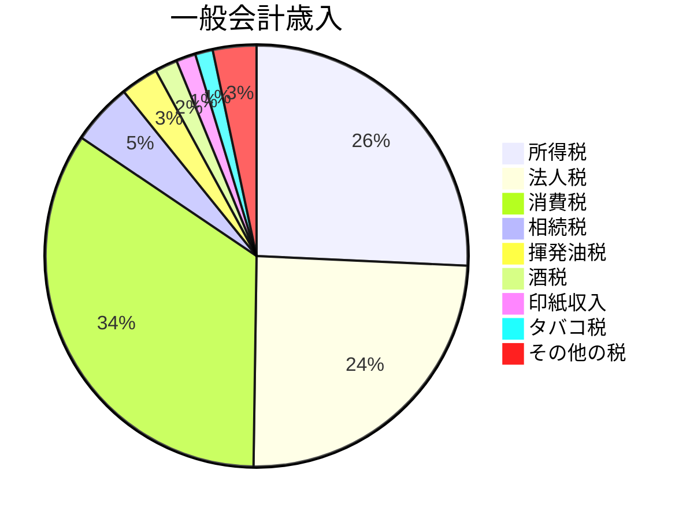

## どんな税？
消費税は、商品の販売やサービスの提供にかかる税金で、広く公平に課される[間接税](/blog/tax-classification/#どこに納めるか)です。ほぼ全ての国内で、商品の販売やサービスの提供、保税地域からの外国貨物の引き取りに課税されます。税金は取引の各段階ごとにかかり、標準税率は10％（うち地方消費税が2.2％）、軽減税率は8％（うち地方消費税が1.76％）です。この税金は、商品やサービスの価格に加算されて消費者が支払うことになります。

## 課税の仕組み
消費税は、商品が作られたり売られたりする過程で重複して課税されることがないように、売ったり買ったりする際にかかる税金を調整することで、税金が重ならないようになっています。具体的には、商品を売った時にかかる消費税から、商品を作るためにかかった税金を差し引いて、重複した税金を取り除く仕組みです。これによって、税金が重なって蓄積されることがなくなります。

## 金額と使い方

出典：令和６年度一般会計予算 歳出・歳入の構成（財務省）
[https://www.mof.go.jp/tax_policy/summary/condition/002.pdf](https://www.mof.go.jp/tax_policy/summary/condition/002.pdf)

消費税の税収（国税分）は、令和６年度予算で23.8兆円あります。

引用元：[https://www.mof.go.jp/tax_information/images/image22.pdf](https://www.mof.go.jp/tax_information/images/image22.pdf)

また、　平成26年度以降、消費税の税収は、社会保障４経費（年金、介護、医療、子ども・子育て支援）に充てることになっています。

## まとめ
消費税は、商品の販売やサービスの提供にかかる税金であり、ほぼ全ての国内で課税されます。税金は取引の各段階ごとにかかり、標準税率は10％（うち地方消費税が2.2％）、軽減税率は8％（うち地方消費税が1.76％）です。消費税は、商品が作られたり売られたりする過程で重複して課税されないように調整されています。具体的には、商品を売った時にかかる消費税から、商品を作るためにかかった税金を差し引いて、重複した税金を取り除く仕組みです。

消費税の税収は、令和６年度予算で23.8兆円あります。また、平成26年度以降、消費税の税収は、社会保障４経費（年金、介護、医療、子ども・子育て支援）に充てられることになっています。

## 引用元
- 消費税について教えてください。（財務省）[https://www.mof.go.jp/tax_information/qanda022.html](https://www.mof.go.jp/tax_information/qanda022.html)
- 消費税はどんな仕組み？（国税庁）[https://www.nta.go.jp/publication/pamph/shohi/aramashi/pdf/003.pdf](https://www.nta.go.jp/publication/pamph/shohi/aramashi/pdf/003.pdf)

