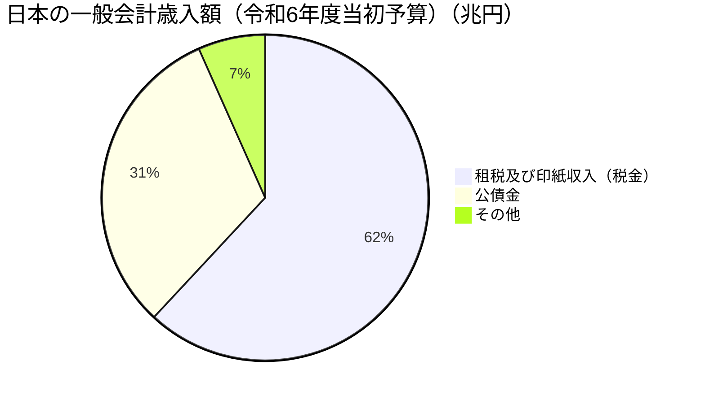
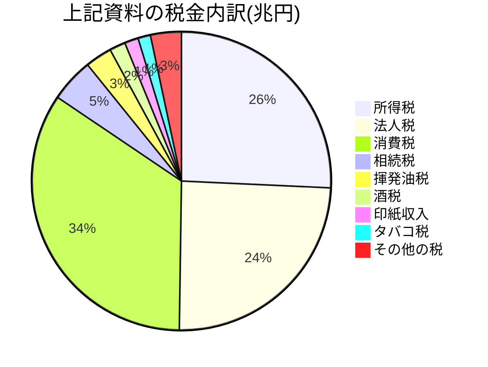
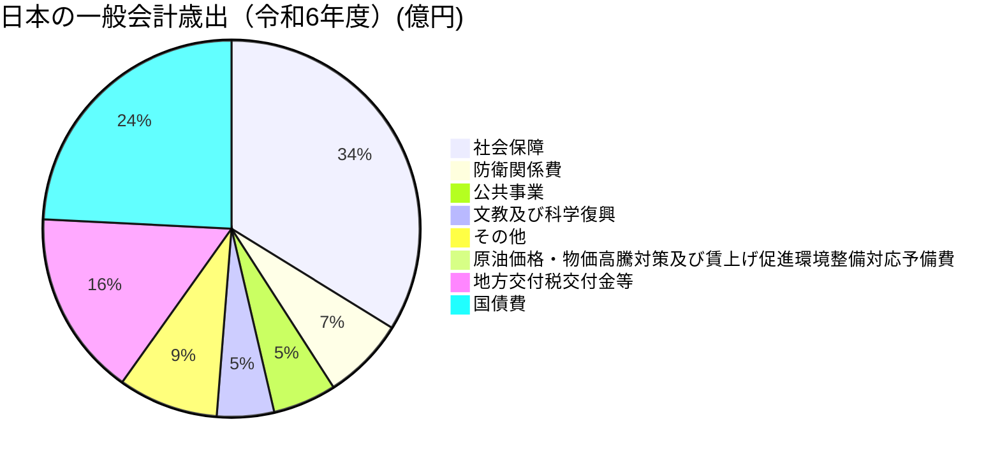

## 収入

国の年間収入は大きく分けて**税金**と**公債金**、**その他の税外収入**に分けられます。

引用元：[https://www.mof.go.jp/tax_policy/summary/condition/002.pdf ](https://www.mof.go.jp/tax_policy/summary/condition/002.pdf)

公債は企業や国民からお金を借り入れる債務（金銭を借りた者が貸し手に対して、その返還をしなければならない義務など）です。これは税金で足りない分を賄うという役割がありますが、それでも国の収入（歳入）は大部分が税金です。（しかし、公債依存度が高く、基礎的財政収支の赤字が続いており、「財政の硬直化」が懸念されています...）

引用元：[https://www.mof.go.jp/tax_policy/summary/condition/002.pdf ](https://www.mof.go.jp/tax_policy/summary/condition/002.pdf)

これらの税金の中でも特に明治時代から続いてきた所得税は長らく国政の中心でした。しかし、消費税や法人税が新設されるに従い**基幹三税**の仕組みへと変化していきました。基幹三税とは、この税金の中で大きな割合を占めている三つのことで、**所得税・法人税・消費税**のことを指します。

## 使い道

では、このようにして集めた税金をどのように使うのでしょうか。

引用元：[https://www.mof.go.jp/tax_policy/summary/condition/002.pdf ](https://www.mof.go.jp/tax_policy/summary/condition/002.pdf)

社会保障費が最も高く、その次に国債費となっています。
日本は超高齢化社会ですので、社会保障費は年々増え続けています。そのため、増税が行われる場合もあります。

## まとめ

今回は日本の税の仕組みについて学習していきました。

### 1. 国のお金の集め方

国は主に 3 つの方法でお金を集めています。

- 税金：みんなが払うお金で、一番多いのは消費税です。次に多いのが所得税と法人税です。
- 借金：国債という形で、国民や企業からお金を借ります。
- その他：国有財産を売ったりして得るお金です。
  この中で一番多いのは税金ですが、借金（国債）の割合も結構多いです。

### 2. 集めたお金の使い方

集めたお金は、主に以下のことに使われています：

- 社会保障：年金や医療、介護などのお金で、一番多く使われています。
- 国の借金の返済：借りたお金を返すのにも多くのお金が使われています。
- 教育や科学：学校や研究のためのお金です。
- 防衛：自衛隊のためのお金です。
- 公共事業：道路や橋を作ったりするお金です。

### 3. 今の問題点

- 日本は高齢者が増えているので、社会保障にかかるお金がどんどん増えています。
- 借金が多くて、返すのに苦労しています。
- 使うお金が多すぎて、新しいことにお金を使うのが難しくなっています。

このような状況を改善するために、国はいろいろな対策を考えています。例えば、税金を増やしたり、使うお金を減らしたりすることを検討しています。税金が身近に感じられてきましたか？しっかり覚えておきましょう！
