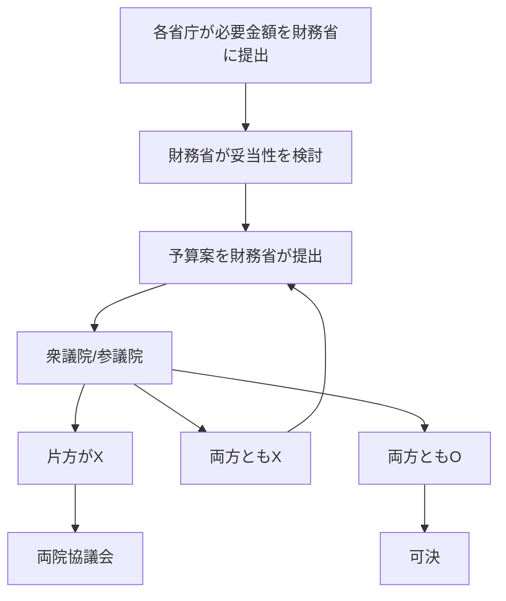

## 予算を決める手順

税金などの国が得たお金の使い道は国会（常会(通常国会の正式名称)）で議決される予算によって決められます。手順は以下の通りです。

| 衆議院 | 参議院 | 次に行われること          |
| ------ | ------ | ------------------------- |
| O      | ×      | [両院協議会](#両院協議会) |
| ×      | O      | [両院協議会](#両院協議会) |
| O      | O      | 可決                      |
| ×      | ×      | 振り出しに戻る            |

### 両院協議会

片方しか賛成しなかった場合以下のような両院協議会が開かれます。

| 衆議院 | 参議院 | 次に行われること |
| ------ | ------ | ---------------- |
| O      | ×      | **強制成立**     |
| O      | O      | 成立             |

このようにして国の予算が決められます。

## 一般会計と特別会計

|      | 一般会計                     | 特別会計                           |
| ---- | ---------------------------- | ---------------------------------- |
| 特徴 | 国のほとんどのお金の出し入れ | 特定の事業や資金を運用する         |
| 用途 | 教育・福祉や道路・公園の整備 | 震災復興、国債の償還や利子の支払い |
| 金額 | 112 兆 5717 億円             | 436.0 兆円                         |

引用元：[https://www.mof.go.jp/policy/budget/budger_workflow/budget/fy2024/seifuan2024/37.pdf](https://www.mof.go.jp/policy/budget/budger_workflow/budget/fy2024/seifuan2024/37.pdf)
　　　[https://www.mof.go.jp/policy/budget/budger_workflow/budget/fy2024/fy2024.html](https://www.mof.go.jp/policy/budget/budger_workflow/budget/fy2024/fy2024.html)

普通は、1 つの財布（一般会計）で全てを管理するのが良いとされています。でも、国の仕事が増えて複雑になってくると、1 つの財布だけではわかりにくくなることがあります。
そんな時に、特定の目的のために別の財布（特別会計）を作ります。例えば、震災復興ためのお金や、年金のためのお金などを別々に管理します。これによって、それぞれの目的にどれだけお金を使ったかがはっきりわかるようになります。
日本では、法律でこの 2 つの方法を使うことが決められています。これにより、国のお金の使い方を分かりやすく、効率的に管理しようとしているんです。

## まとめ

今回は予算を決める手順と予算の種類について触れていきました。

### 国の予算はどうやって決まるの？

1. まず、国の各部署がいくらお金が必要か考えます。
2. 財務省（お金を管理する役所）がその金額を確認します。
3. 財務省が予算案（お金の使い方の計画）を作ります。
4. その予算案を国会（国の大事なことを決める場所）に出します。
5. 国会では、衆議院と参議院という 2 つのグループで話し合います。
6. 両方のグループが「OK」と言えば、その予算案が決まります。
7. もし意見が分かれたら、もう一度話し合いをします。

### 国のお金の管理の仕方

国のお金は、大きく分けて 2 つの方法で管理されています。

1. 一般会計
   - 国の主なお金の出し入れを管理します。
   - 学校、病院、道路などを作るのに使います。
   - 2024 年は約 113 兆円です。
2. 特別会計
   - 特別な目的のためのお金を別に管理します。
   - 例えば、大きな地震からの復興や、国の借金を返すためのお金です。
   - 2024 年は約 436 兆円です。

### なぜ 2 つの方法で管理するの？

- 1 つの財布だけだと、どのお金をどこに使ったか分かりにくくなることがあります。
- 特別な目的のお金を別に管理すると、どれだけ使ったかがはっきり分かります。
- こうすることで、国のお金の使い方が分かりやすくなります。
  このように、国のお金の決め方と使い方には、みんなが分かりやすいようにいろいろな工夫がされているんです。

しっかり覚えておきましょう。
