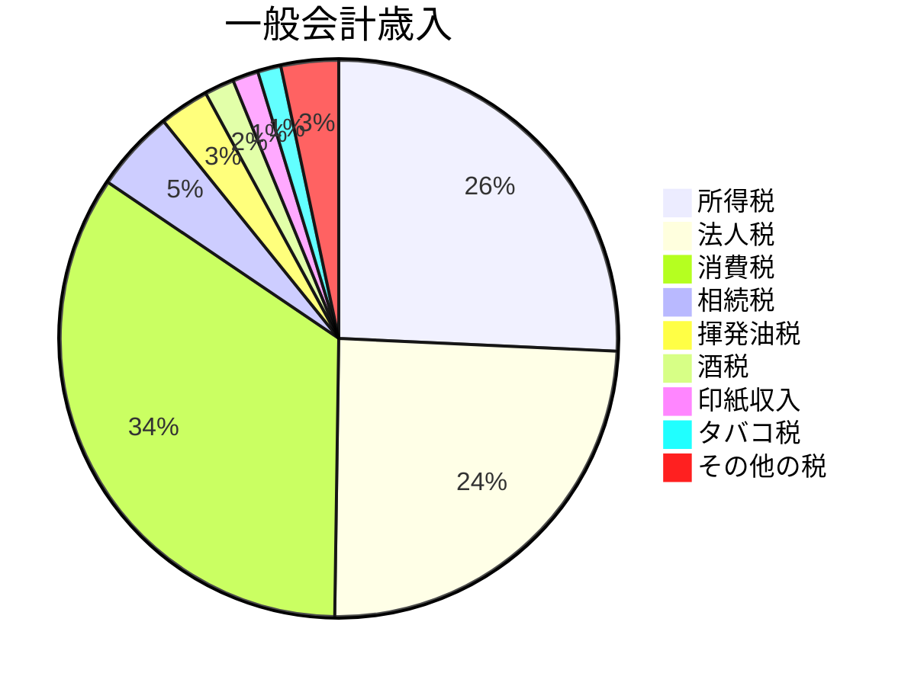

所得税は、会社からもらう給料や、自分で商売をして稼いだお金などにかかる税金です。こうして手に入れた1年分のお金（収入）から、必要経費などにあたる額を差し引いた残りの金額が、所得税の額を計算するもとになる「所得」になります。
$$
収入-経費=所得
$$
税金の額を計算する際には、家族構成など本人を取り巻く状況などに応じて、この所得から、更に一定の額を差し引きます（「控除」といいます）。また、控除後の所得が高い部分ほど、適用される税率は高くなる仕組みになっています（「累進税率」といいます）。
$$
(所得-控除)×税率=税額
$$
累進課税の割合はこのようになっております。

$$
n=所得-控除-経費
$$
とします。

| 課税所得金額        | 税率  | 控除額      |
| :------------ | :-- | :-------- |
| n≦195万        | 5%  | 0円       |
| 195万≦n≦330万   | 10% | 97500円   |
| 330万≦n≦695万   | 20% | 427500円  |
| 695万≦n≦900万   | 23% | 636000円  |
| 900万≦n≦1800万  | 33% | 1536000円 |
| 1800万≦n≦4000万 | 40% | 2796000円 |
| 4000万≦n       | 45% | 4796000円 |

※出典：国税庁「[No.2260 所得税の税率](https://www.nta.go.jp/taxes/shiraberu/taxanswer/shotoku/2260.htm)」

このように、所得税は、所得の大きさに応じた負担を求めることができ、また、家族構成などの状況に応じたきめ細かな配慮を行うことができるものです。
また、消費税や相続税と違って、主に働く世代（現役世代）が負担しているという特徴があります。

出典：令和６年度一般会計予算 歳出・歳入の構成（財務省）
[https://www.mof.go.jp/tax_policy/summary/condition/002.pdf](https://www.mof.go.jp/tax_policy/summary/condition/002.pdf)

所得税の税収は、直近で17.9兆円（令和６年度予算額）となっており、かなり高い割合を占めています。

## まとめ
所得税は、会社からもらう給料や自分で商売をして稼いだお金などにかかる税金です。所得税の計算は、収入から必要経費を差し引いた残りの金額である「所得」に基づいて行われます。また、所得税の額は累進税率という仕組みによって決まります。累進税率は所得に応じて税率が高くなる仕組みであり、所得には家族構成などに応じた控除額も適用されます。所得税は現役世代が主に負担している税金であり、一般会計歳入の中でも大きな割合を占めています。

## 引用
- 所得税について教えてください（財務省）　[https://www.mof.go.jp/tax_information/qanda018.html](https://www.mof.go.jp/tax_information/qanda018.html)
